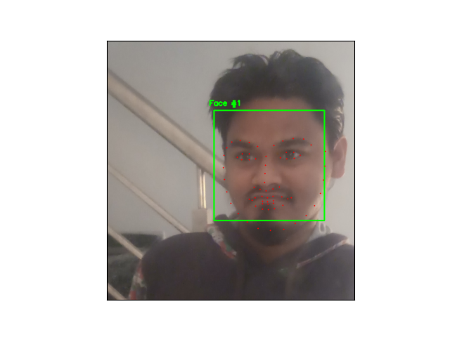

# Facial Landmarks Detection with DLIB
### Detects the face landmarks such as nose, eyes, etc. using just Python, OpenCV and dlib

Amazing and easy face landmarks detector with dlib library.


## **Key Points**
1. Steps involved:
    1. Localize the face in the image
    2. Detect the key facial structures on the face ROI
2. Assumptions:
    1. We already have the trained face detector and face landmark detector. ( can be download from [here] )
3. Variety of things the face detector detects:
    1. Nose
    2. Mouth
    3. Left eye
    4. Right eye
    5. Left eyebrow
    6. Right eyebrow
    7. Jaw


 ## **Requirements: (with versions i tested on)**
 1. python          (3.7.3)
 2. opencv          (4.1.0)
 3. numpy           (1.61.4)
 4. imutils         (0.5.2)
 5. dlib            (19.17.0)

 ## **Commands to run the detection:**
 ```
python3 facial_landmarks.py --shape-predictor shape_predictor_68_face_landmarks.dat --image images/1.jpg 
```

## **Results:**
The results are awesome. We can see pretty accurate face landmark detections.

**Input**


**Output**



**Input**


**Output**


  [here]: <http://dlib.net/files/shape_predictor_68_face_landmarks.dat.bz2>
